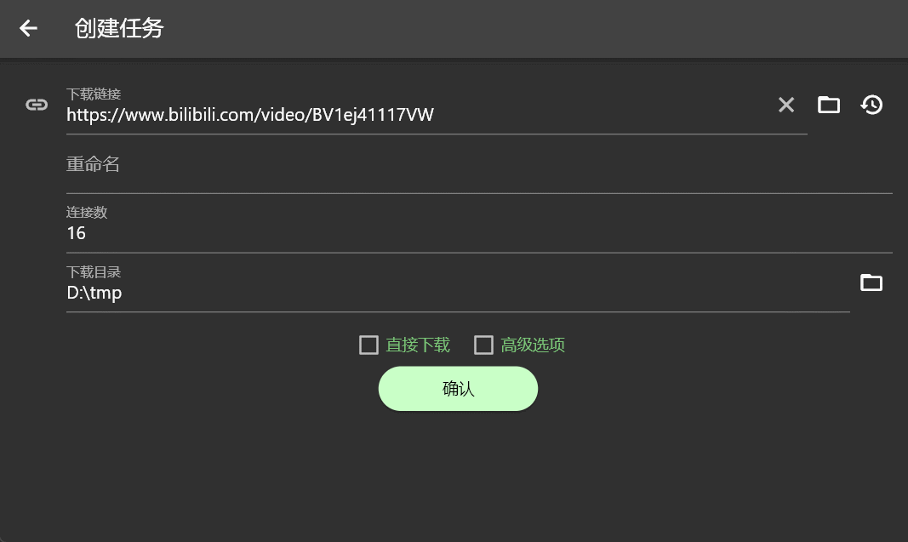
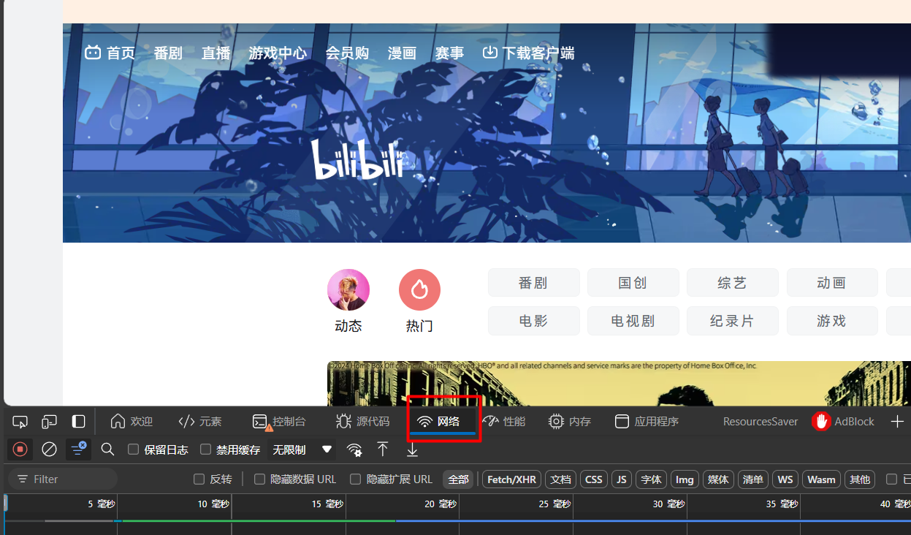
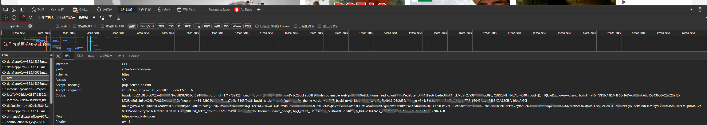
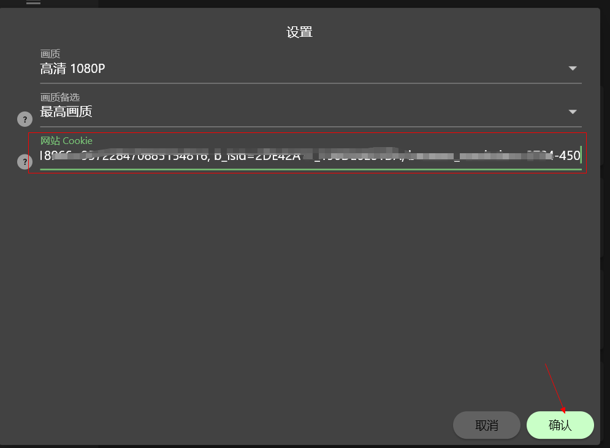

# Gopeed B站视频下载扩展

## 声明

本项目代码全部开源，仅供学习交流使用，不得用于商业用途，如有侵权请联系作者删除

## 安装

打开Gopeed扩展页面，输入`https://github.com/monkeyWie/gopeed-extension-bilibili`，点击安装即可。

## 使用说明

安装完扩展后，在任务创建页面输入B站视频链接，点击创建任务即可解析下载，效果图：



### 清晰度说明

由于B站高清视频(>=720P)需要登录才能观看，所以默认下载最高的画质只能是`480P`，如果需要下载更高画质的视频，需要拿到浏览器上B站的`cookie`，然后在Gopeed扩展页面设置`cookie`，设置方法如下：

1. 打开B站视频页面，按`F12`打开开发者工具，切换到`网络`选项卡



2. 刷新页面，找到`api.bilibili.com`的请求，复制请求头里的`cookie`值



3. 打开扩展设置页面，设置`cookie`值，点击保存



然后重新解析即可下载更高画质的视频。

### 音视频分离

由于B站视频是音视频分离的，在下载的时候会下载两个文件，一个是视频文件，一个是音频文件，下载完成后需要自行合并，目前Gopeed不支持音视频合并，可以使用`ffmpeg`命令行工具合并，命令如下：

```shell
ffmpeg -i video.mp4 -i audio.mp4 -c copy -f mp4 output.mp4
```

## 相关链接

- [bili-api](https://github.com/renmu123/biliAPI) bilibili 接口的 node 包装库
- [gopeed-docs](https://docs.gopeed.com/zh/dev-extension.html) Gopeed扩展开发文档
