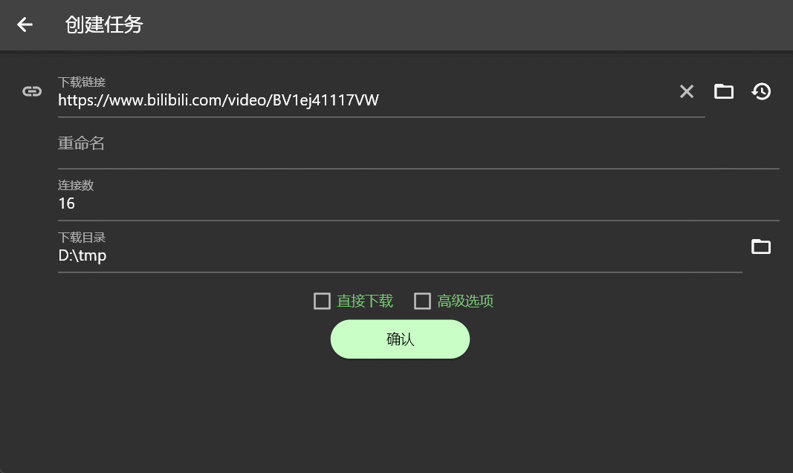
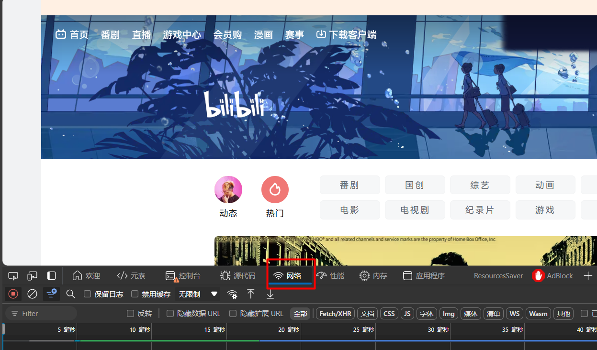
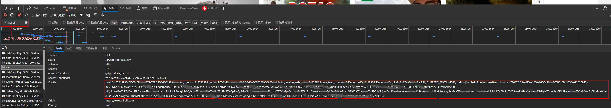
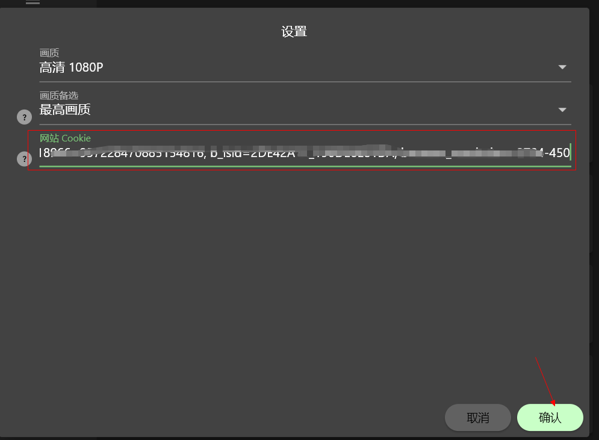

# Gopeed B站视频下载扩展

使用 [Gopeed](https://gopeed.com) 下载哔哩哔哩视频和分 P 视频。

> 需要 Gopeed 版本 >= 2.0.0。

## 功能特性

- **视频下载** — 粘贴 B 站视频链接即可下载。
- **分 P 批量下载** — 支持下载全部分 P、指定分 P 或分 P 范围。
- **最高 8K 画质** — 支持选择最高 8K 画质，实际可用画质取决于视频源和账号权限。
- **自动合并音视频** — 通过 FFmpeg 自动将分离的音视频合并为一个 MP4，无需手动操作。
- **画质选择** — 支持设置画质和备选画质，以及开启 HDR、杜比视界，需视频源及账号权限支持。

## 安装

打开 Gopeed 的扩展页面，输入 `https://github.com/monkeyWie/gopeed-extension-bilibili`，点击安装。

## 使用说明

打开 Gopeed 的**创建任务**面板，粘贴 B 站视频链接，点击下载即可。以下是三种链接示例，请将 `BV_ID` 替换为实际视频的 BV 号：

| 类型 | 示例链接 |
| --- | --- |
| 视频或全部分 P | `https://www.bilibili.com/video/BV_ID` |
| 指定分 P | `https://www.bilibili.com/video/BV_ID?p=2` |
| 分 P 范围 | `https://www.bilibili.com/video/BV_ID?p=1-3` |

### 分 P 视频

不指定 `p` 参数时会解析全部分 P，可在创建任务面板选择需要下载的视频。也可以使用 `p=2-` 下载第 2 P 及之后的视频，或使用 `p=-3` 下载前 3 P。

### 画质与 Cookie

在扩展设置中选择需要的画质；指定画质不可用时，会使用设置的备选画质。需要登录或大会员权限的画质，请配置具有相应权限的 B 站账号 Cookie。

1. 打开 B 站视频页面，按 `F12` 打开开发者工具，切换到**网络**选项卡。

2. 刷新页面，找到 `api.bilibili.com` 的请求，复制请求头中的 `cookie` 值。

3. 打开 Gopeed 的扩展设置，填写**网站 Cookie**，保存后重新创建任务。

## 声明

本项目代码全部开源，仅供学习交流使用，不得用于商业用途，如有侵权请联系作者删除。

## 相关链接

- [bili-api](https://github.com/renmu123/biliAPI)
- [Gopeed 扩展开发文档](https://docs.gopeed.com/zh/dev-extension.html)
